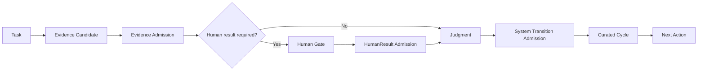
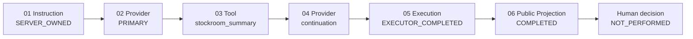
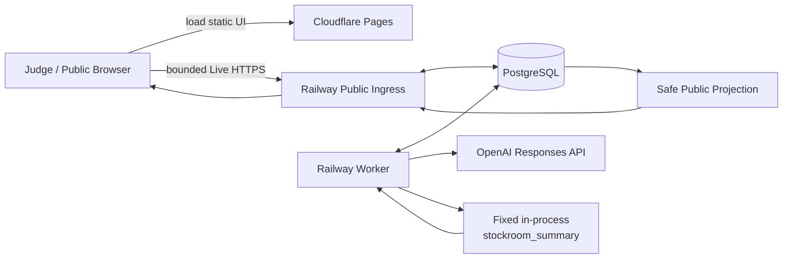

# AI Software Command Center

> **From an AI claim to inspectable evidence.**

AISCC is a **software engineering governance control plane for AI-assisted work**. It places AI/agent output inside an inspectable chain of Task scope, evidence admission, system-owned state transitions, Human-owned verification, Judgment, curated Cycle provenance, and Next Action.

The goal is not to make another coding agent. The goal is to make it possible to distinguish:

```text
what an Agent proposed
!= what the System admitted
!= what a Human decided
```

> **Current public status:** Recorded Run Replay and Public Bounded Live are deployed at **https://aiscc-replay.pages.dev/**. The public Live surface is intentionally bounded to one fixed synthetic Stockroom scenario. The current hosted provider path uses OpenAI; arbitrary prompts, repositories, tools, providers, endpoints, and secrets are not accepted from public users.

---

## Why this exists

Strong code generation does not by itself settle project governance.

In a long-running software project, authority can drift between prompts, Tasks, policy documents, source versions, execution results, and review decisions. A completion claim can be mistaken for accepted evidence; one proof type can substitute for another; Human-owned checks can be reported as complete by the wrong actor; and raw chat history can blur failed attempts with accepted project memory.

AISCC makes those boundaries explicit.

Its product hypothesis is that **task-scoped evidence ownership, proof non-substitution, system-owned transition admission, Human-owned gates, and curated Cycle memory become more useful when connected as one reviewable chain**.

---

## Governance chain



The compact product flow is:

```text
Task → Evidence → Judgment → Cycle → Next Action
```

A `TaskContract` fixes the goal, non-goals, allowed/forbidden scope, evidence ownership, and stop conditions. An Agent or Executor can produce work and evidence candidates. Applicable authorities decide whether evidence is admitted and whether a transition is allowed. A `Judgment` records the semantic outcome without directly mutating workflow state. A `Cycle` preserves selected durable provenance and supports a stable next action.

Detailed contracts:

- [AISCC Architecture](.aiassistant/rules/AISCC_ARCHITECTURE.md)
- [AISCC Orchestration](.aiassistant/rules/AISCC_ORCHESTRATION.md)
- [Security / Sandbox / Runtime Boundary](.aiassistant/rules/AISCC_SECURITY_SANDBOX.md)

---

## Authority model

| Actor | Owns | Does not own |
| --- | --- | --- |
| Agent / Executor | reasoning, proposed changes, execution output, evidence candidates | authoritative workflow state, evidence admission, Human verification, terminal transition |
| AISCC System | state/version, transition evaluation and admission, evidence compatibility checks, durable gate projection | policy exceptions or Human acceptance |
| Human | designated verification, `HumanResult`, exceptional approval, business judgment, final public positioning | automatic workflow mutation or automatic promotion of a result into Judgment |
| Command Center | Task/Cycle policy, rubric-owned Judgment, curated provenance, next-action direction | impersonating a designated Human or bypassing System transition admission |

Core boundaries:

```text
Agent output != System state
Evidence candidate != Admitted evidence
Executor completed != Human acceptance
Human result != Judgment
Judgment != Transition decision
Recorded artifact != current Live execution
```

---

## What is implemented

### 1. Recorded Run Replay

The public Replay surface exposes **four sanitized, read-only historical workflow records**.

It lets a reviewer inspect:

- Task and scope
- system-admitted state transitions
- execution provenance
- evidence admission
- Human-owned gates
- Judgment
- Cycle/history
- Next Action
- the difference between an Agent claim and admitted system evidence

Viewing Replay performs no current AI execution.

### 2. Public Bounded Live

The public Live surface runs one fixed synthetic scenario:

```text
scenario: stockroom-s1-normal
version: 1.0.0
mode: PUBLIC_BOUNDED_LIVE
```

The public user cannot choose an arbitrary:

```text
task
repository
prompt
provider
model
endpoint
tool
secret
```

The current Live UI shows an inspectable execution trace derived from durable, allowlisted public evidence:



The important boundary remains visible in the product:

```text
Successful AI execution
!=
Human acceptance
```

The Live trace does not expose raw provider requests, raw model responses, reasoning, secrets, read capabilities, or private protocol records.

### 3. Self-Dogfooding

AISCC used the same governance workflow on its own development.

The accepted self-use lineage connected Task scope, execution, evidence admission, Judgment, Cycle provenance, and a Cycle-derived Next Action. This is evidence that the workflow was actually used; it is **not** a claim of novelty, superiority, independent validation, or general reliability.

See [AISCC Self-Dogfood Golden Cycle](docs/AISCC_SELF_DOGFOOD_GOLDEN_CYCLE.md).

### 4. Comparative evaluation

P3-1 compared two interpretations of the same frozen M05 packet:

- `AISCC_GOVERNED`, using admitted governance records;
- `EXECUTOR_REPORT_BASELINE`, a conservative ordinary report reader that could not use governance records to derive its decision.

This was a **synthetic ablation**, not a competitor-product benchmark. Only one planned row was eligible, so the result does not support broad claims of superiority.

See:

- [Comparative Evaluation Summary](docs/AISCC_COMPARATIVE_EVALUATION.md)
- [Accepted Comparative Evaluation Protocol](.aiassistant/reports/aiscc/AISCC_COMPARATIVE_EVALUATION_PROTOCOL.md)

---

## Current public execution flow



The browser receives only a capability-scoped, public-safe projection. Provider/tool/private protocol bodies remain outside the public surface.

---

## Deployed infrastructure

| Layer | Current deployment |
| --- | --- |
| Public frontend | Cloudflare Pages |
| Public Live ingress | Railway |
| Public Live worker | Railway |
| Durable state / accounting / execution records | PostgreSQL |
| Hosted AI provider | OpenAI |
| Public Live tool | fixed in-process `stockroom_summary` |
| Public artifact mode | Recorded Replay + Bounded Live |

Public demo:

**https://aiscc-replay.pages.dev/**

The public runtime is deliberately narrow. It is a competition/demo boundary, not a general-purpose public coding-agent execution service.

### Local verification

Install the locked development environment and verify the deterministic public artifact:

```bash
uv sync --locked
uv run python scripts/build_public_replay.py --check
uv run python -m pytest -q tests/unit/test_public_replay_build.py
```

These checks do not invoke the hosted provider or create a Public Live run. The broader integration suite requires an isolated PostgreSQL test database and its task-specific environment configuration.

---

## Provider boundary and extensibility

AISCC's execution service is not structurally coupled to a single provider API.

The code defines a provider port:

- [`ProviderAdapter`](src/aiscc/providers/ports.py)
- [`ProviderProfile`](src/aiscc/providers/models.py)

Current implementations include:

- the hosted [OpenAI Responses adapter](src/aiscc/providers/openai_responses.py);
- an owner/local [deterministic Stockroom provider](src/aiscc/providers/local_deterministic.py).

The **current hosted public release uses OpenAI**. Additional external AI providers/agents are not currently implemented and validated as public runtime integrations.

This separation is intentional:

```text
Governance semantics
!=
Provider implementation
!=
Evidence admission
!=
Human Judgment
```

---

## Docker / isolated execution boundary

The repository also contains a Docker-backed bounded runtime path:

- [`src/aiscc/runtime/docker.py`](src/aiscc/runtime/docker.py)

The repository's bounded Docker runner includes controls such as read-only container filesystems, dropped Linux capabilities, `no-new-privileges`, process/memory/CPU limits, bounded output, timeout/cancellation handling, ownership checks, and a `network=none` isolation profile.

However:

> **The current Public Bounded Live release does not use Docker as its public tool runtime.**

The released public Stockroom tool is the fixed in-process `stockroom_summary` path. Therefore AISCC does **not** claim that the current public service is a generalized per-run Docker sandbox.

Docker/isolation work should be understood as a repository runtime implementation and an extensibility/security direction, not as the topology of the currently deployed public Live path.

See [Security / Sandbox / Runtime Boundary](.aiassistant/rules/AISCC_SECURITY_SANDBOX.md).

---

## Implemented now vs. designed for extension

| Area | Implemented now | Designed / open for extension |
| --- | --- | --- |
| Governance chain | Task → Evidence → Judgment → Cycle → Next Action | broader operator workflows and more governance views |
| Recorded Replay | four public read-only scenarios | more admitted scenario families |
| Public Live | one fixed synthetic Stockroom scenario | more bounded scenarios |
| Hosted provider | OpenAI | additional provider/agent adapters |
| Public tool runtime | fixed in-process `stockroom_summary` | broader allowlisted tools under the same evidence/security boundary |
| Isolation | bounded Docker runtime exists in repository for non-public/owner-side paths | generalized isolated execution runtime |
| Human boundary | explicit Human-owned gates and `NOT_PERFORMED` public boundary | richer Human review/approval UX |
| Public trace | allowlisted durable execution projection | richer safe projections without exposing private protocol data |

The right column is **not a claim that these features already exist**.

---

## Recorded Replay vs. Bounded Live

| Surface | Meaning | Current status |
| --- | --- | --- |
| Recorded Replay corpus | Sanitized records of previously executed workflows | `CANONICAL / PERSISTED` |
| Public Replay | Public read-only viewer | `DEPLOYED` |
| Public Bounded Live | Fixed synthetic real-time execution | `RELEASED` |
| Inspectable Live trace | Public-safe instruction/provider/tool/execution projection | `DEPLOYED` |
| Arbitrary public coding tasks/repositories | General-purpose agent execution | `NOT SUPPORTED` |

Replay and Live have different meanings:

```text
Recorded Replay = inspect prior admitted history
Bounded Live    = inspect one current bounded execution
```

---

## Public safety boundary

The public runtime denies free-form execution.

Public users cannot supply arbitrary:

- repositories or uploads;
- prompts/tasks;
- model/provider selection;
- tools or shell commands;
- network destinations;
- endpoints;
- credentials/secrets.

The public Live projection intentionally excludes:

- raw OpenAI request/response bodies;
- reasoning;
- provider credentials;
- read capabilities;
- private protocol storage references;
- internal DB identities;
- arbitrary exception text.

See [Competition Public Runtime Boundary](.aiassistant/reports/aiscc/AISCC_COMPETITION_PUBLIC_RUNTIME_BOUNDARY.md).

---

## Repository evidence / provenance map

| Question | Repository source |
| --- | --- |
| What is the product thesis? | [AISCC Product Thesis](.aiassistant/reports/aiscc/AISCC_PRODUCT_THESIS.md) |
| What claims are limited by prior art? | [AISCC Prior-Art Boundary](.aiassistant/reports/aiscc/AISCC_PRIOR_ART_BOUNDARY.md) |
| Who owns state, evidence, Judgment, and Cycle semantics? | [Architecture](.aiassistant/rules/AISCC_ARCHITECTURE.md) and [Orchestration](.aiassistant/rules/AISCC_ORCHESTRATION.md) |
| What is the public runtime boundary? | [Competition Public Runtime Boundary](.aiassistant/reports/aiscc/AISCC_COMPETITION_PUBLIC_RUNTIME_BOUNDARY.md) |
| What is the sandbox/security design boundary? | [Security / Sandbox](.aiassistant/rules/AISCC_SECURITY_SANDBOX.md) |
| What did the bounded comparison show? | [Comparative Evaluation Summary](docs/AISCC_COMPARATIVE_EVALUATION.md) |
| What did the accepted self-use lineage show? | [AISCC Self-Dogfood Golden Cycle](docs/AISCC_SELF_DOGFOOD_GOLDEN_CYCLE.md) |

---

## Current limitations

- Public Bounded Live exposes **one fixed synthetic scenario**, not arbitrary development work.
- The current hosted external provider is **OpenAI**; additional hosted providers are not implemented/validated.
- The public Stockroom tool is fixed and in-process; the deployed public path is **not** a generalized Docker sandbox.
- The repository contains Docker-backed bounded runtime work, but that should not be confused with the current public deployment topology.
- The comparative evaluation has only one eligible matched row and does not establish general product superiority.
- Self-dogfooding is project-produced evidence, not independent validation.
- AISCC does not claim broad safety, accuracy, productivity, cost, or generalization improvements without corresponding evidence.

---

## Claim boundary

AISCC acknowledges overlap with existing work in specification workflows, agent orchestration, evidence gates, permission and Human review, persistent memory, reviewer systems, provenance, and self-use workflows.

It does **not** claim invention of those primitives.

The product focus is their integration into one inspectable governance chain:

```text
instruction
→ execution
→ evidence
→ Human verification when required
→ Judgment
→ durable provenance
→ Next Action
```

The project deliberately prefers:

```text
"we implemented and exercised this governance chain"
```

over:

```text
"we invented a category that did not exist before"
```

See [AISCC Prior-Art Boundary](.aiassistant/reports/aiscc/AISCC_PRIOR_ART_BOUNDARY.md).

---

## Project / competition status

| Item | Status |
| --- | --- |
| Core governance implementation | `IMPLEMENTED / EVIDENCED` |
| Bounded self-use | `ACCEPTED / CLOSED` |
| Comparative evaluation | `HUMAN_PROVIDED / ACCEPTED / CLOSED` |
| Public Recorded Replay | `DEPLOYED` |
| Public Bounded Live | `RELEASED` |
| Inspectable Live trace | `DEPLOYED / HUMAN TRACE QA PENDING` |
| Wanted AI Championship submission | `SUBMITTED` |

---

## Competition positioning

AISCC is not presented as a claim that no similar primitive existed before.

The competition positioning is:

> **AISCC implements AI-assisted software work as an inspectable governance workflow: what was instructed, what actually executed, what evidence was admitted, what a Human verified, what was judged, and what became the next durable action.**

The same governance flow was applied to AISCC's own development.

---

## Public demo

**[Open the AISCC public demo](https://aiscc-replay.pages.dev/)**

Recommended review path:

1. inspect the four **Recorded Run Replay** scenarios;
2. start the one fixed **Bounded Live** scenario;
3. inspect the Live trace from **Instruction → Provider → Tool → Execution → Public Projection**;
4. note the explicit **Human decision · NOT_PERFORMED** boundary.

---

## Status

Competition prototype / public bounded release.

The repository intentionally keeps product code and governance/provenance records together so the software and the evidence about how it was developed can be inspected from the same project.
